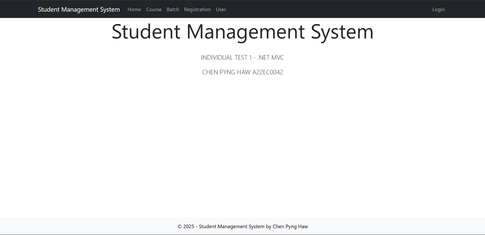
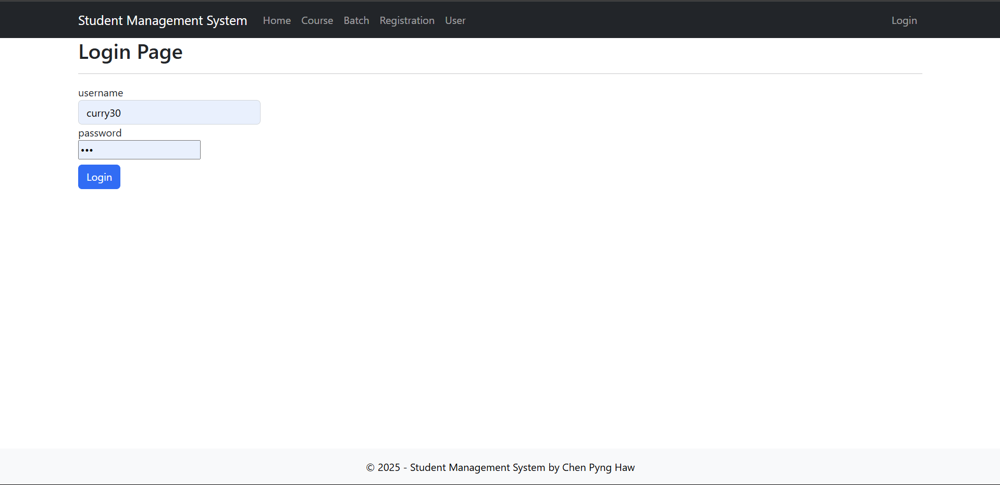
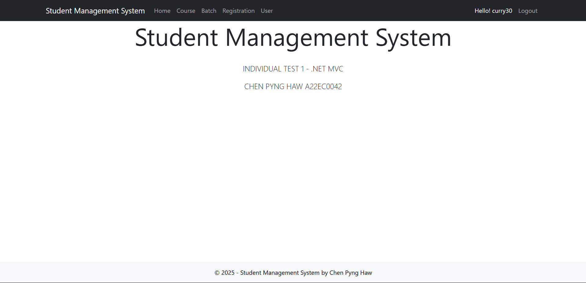
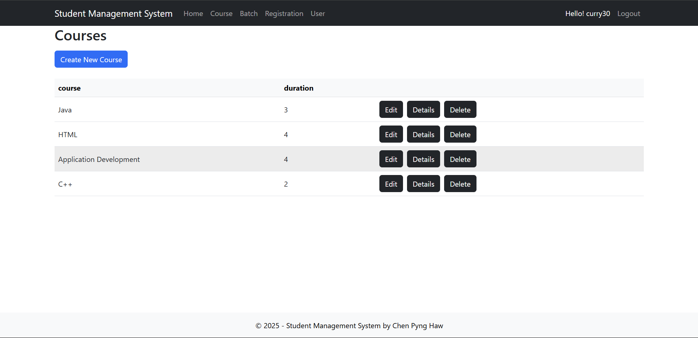
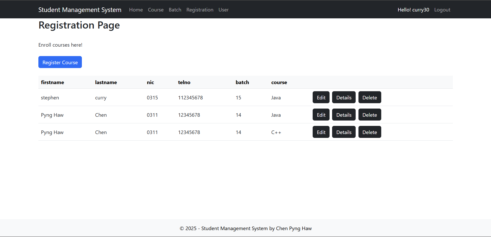
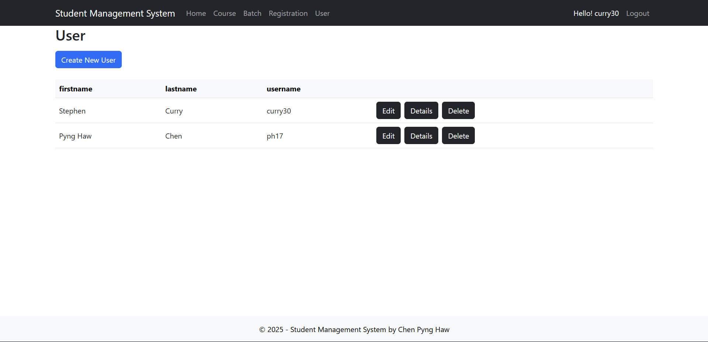
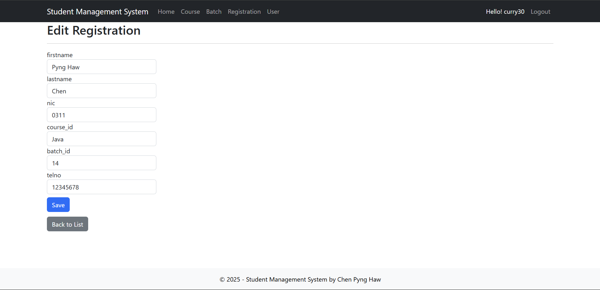
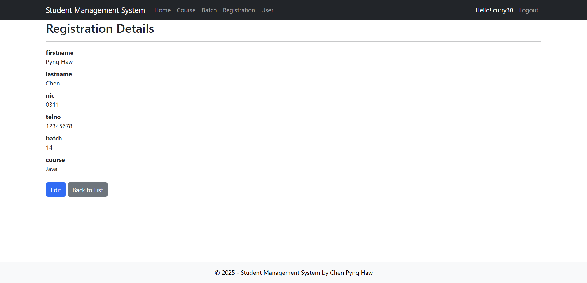
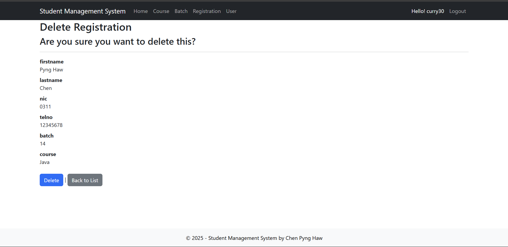

# Student Management System (.NET MVC)

This is a simple Student Management System built with ASP.NET MVC (.NET Framework) as part of an individual assignment.

## Features

✅ User login/logout  
✅ Course management (Create, Edit, Delete, View)  
✅ Batch management  
✅ Student registration  
✅ Responsive UI using Bootstrap 

## Technologies Used

- ASP.NET MVC (with .NET Framework)  
- Entity Framework (Database First, .edmx)  
- SQL Server  
- Bootstrap 5  
- Visual Studio 2022

## Page View

#### Home Page (Before Login)

#### Login Page

#### Home Page (After Login)

#### Course, Registration and User Page

#### Edit, Details and Delete Page (Registration)

